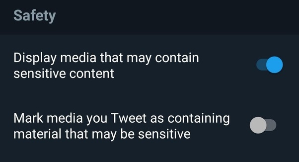
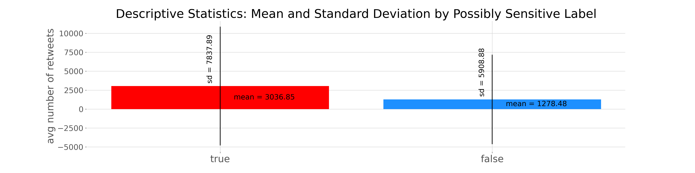
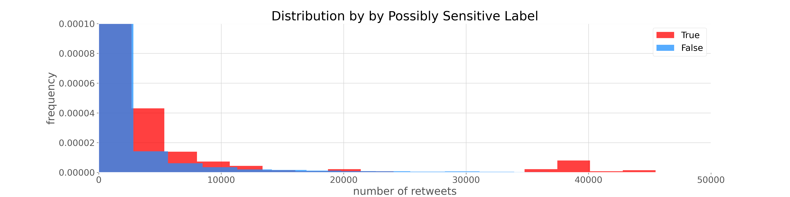
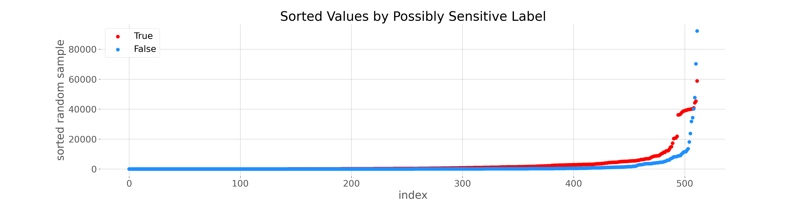
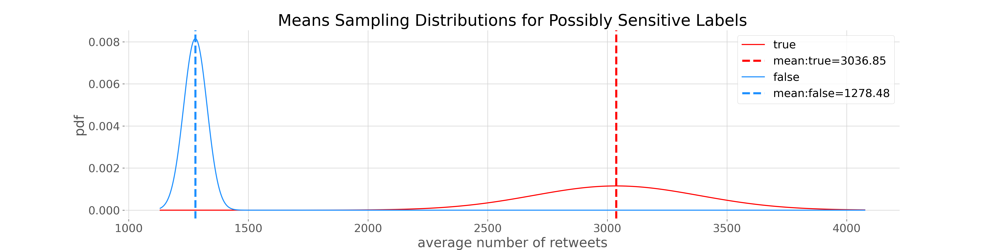
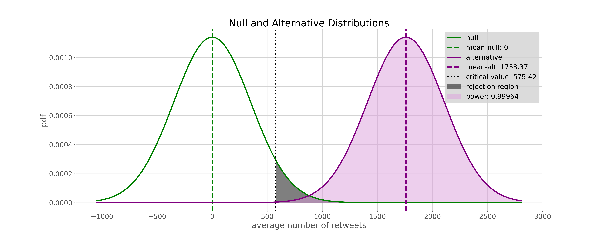
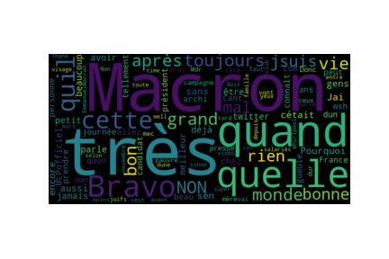
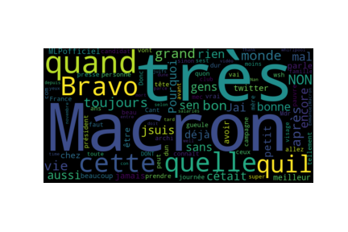

# Do "Possibly Sensitive" Labels Increase Tweet Reach?  



[Introduction](#Introduction) 


[Pipeline](#Pipeline)    


[EDA](#EDA-Exploratory-Data-Analysis)   

[Hypothesis Testing](#Hypothesis-Testing)   

[Conclusion](#Conclusion) 


## Introduction  
Back in the day, we bought music in stores! On new music Tuesday, that **Explicit Lyrics** sticker was on the only version we wanted, and it sold out fast. Does Twitter's **Possibly Sensitive** label have a similar effect? We will examine a collection of [Quote Tweets](https://twiends.com/learn/growing-with-quote-tweets) labeled True or False for [Possibly Sensitive](https://help.twitter.com/en/rules-and-policies/media-settings), and compare their average number of retweets.  

<br>

### Twitter allows *sensitive* material     
> *By appropriately marking your media settings, Twitter can identify [possibly sensitive](https://help.twitter.com/en/rules-and-policies/media-settings) content that other users may not wish to see, such as violence or nudity. If you intend to regularly post such content, we ask that you please adjust your media settings. ~Twitter*

<br>

## The dataset  
A collection of 214,936 (216,912 in original JSON file) French tweets from 2017 during the Macron, Le Pen presidential election. This dataset includes information about [*quote tweets*](https://twiends.com/learn/growing-with-quote-tweets) which are often used as a way to increase both tweet exposure and user followers. We will explore this 25,969 datapoint subset to determine whether [possibly sensitive](https://help.twitter.com/en/rules-and-policies/media-settings) designations increase the number of re-tweets acheived. The data is in a JSON file and will need to be parsed prior to analysis.

<br>

## Pipeline 
Big Data requires big tools. Utilizing [Docker](https://www.docker.com/) allows us to create protected, reliable environment for our work. Through a Docker container, we will use [Pyspark](https://spark.apache.org/docs/latest/api/python/index.html), a Python environment for [Apache Spark](https://spark.apache.org/). Spark dataframes add a schema to the resilient distributed database, allowing fast computing and the ability to create a [Spark SQL](https://spark.apache.org/sql/) context, so we can query our data usign SQL--thank you Spark. 

- SQL Query on a temporary table from the Spark dataframe:
```sql
SELECT quoted_status.possibly_sensitive,
       COUNT(quoted_status.retweeted) AS count, 
       AVG(quoted_status.retweet_count) AS avg_n_retweets
FROM temp1
GROUP BY quoted_status.possibly_sensitive;
```

<br>

## EDA Exploratory Data Analysis  

Of the 214,936 (216,912) available, 25,969 tweets have **quote tweet** values. Of those, 15,094 have a True or False **possibly sensitive** label. 512 of these quote tweets are labeled True for **possibly sensitive** with an average number of retweets of 3036.85. The datapoints in this **quote tweet** subset that are labeled false for **possibly sensitive** number 14,582 with an average number of retweets of 1278.47.
 

|possibly_sensitive|count|    avg_n_retweets|    sd_n_retweets|max_n_retweets|min_n_retweets|
|------------------|-----|------------------|-----------------|--------------|--------------|
|              null|10875|205.85728735632185|1289.193509294055|         45480|             0|
|              true|  512|    3036.845703125|7845.550715218757|         58847|             0|
|             false|14582|1278.4751748731312|5909.084277615833|        339281|             0|

- True = flagged as possibly sensitive  
                                                                                                                     
- False = not flagged as possibly sensitive     

<br>

**Descriptive Statistics**  

|                   |         True |         False |   False Sample |
|:------------------|-------------:|--------------:|---------------:|
| size              |   512        |  14582        |     512        |
| mean              |  3036.85     |   1278.48     |     943.137    |
| sd                |  7837.89     |   5908.88     |    4211.69     |
| min               |  3036.85     |   1278.48     |     943.137    |
| 1Q                |    28.75     |      3        |       2        |
| median            |   377.5      |     34        |      28        |
| 3Q                |  2493.5      |    363        |     280        |
| max               | 58847        | 339281        |   70318        |
| 95% quantile low  |     0        |      0        |       0        |
| 95% quantile high | 38451.1      |  11970        |    7823.27     |
| IQR               |  2464.75     |    360        |     278        |
| 1Q - 1.5*IQR      | -3668.38     |   -537        |    -415        |
| 3Q + 1.5*IQR      |  6190.62     |    903        |     697        |
| number of outliers|    52        |   2485        |      87        |
| % outliers        |     0.101562 |      0.170416 |       0.169922 |

<br>

  



<br> 

**Inferential Statistics for Sampling Means**  

<br> 

|             |     True |      False |   False_Sample | 
|:------------|---------:|-----------:|---------------:| 
| size        |  512     | 14582      |        512     | 
| mean        | 3036.85  |  1278.48   |       1736.38  | 
| se          |  346.389 |    48.9324 |        356.223 | 
| 95% CI low  | 2467.09  |  1197.99   |       1150.44  | 
| 95% CI high | 3606.6   |  1358.96   |       2322.31  |  

<br>


**Sampling Mean Distribution**   

<a href="https://www.codecogs.com/eqnedit.php?latex=\bg_white&space;\\&space;\mu_{true}\sim&space;N\left&space;(\mu_{true},&space;\frac{sd_{true}}{\sqrt{n_{true}}}&space;\right&space;)&space;\\&space;\mu_{false}\sim&space;N\left&space;(\mu_{false},&space;\frac{sd_{false}}{\sqrt{n_{false}}}&space;\right&space;)" target="_blank"></a>
<br>
 


<br> 
 
## Hypothesis Testing  
We are interested in determining whether there is evidence that a tweet labeled as **possibly sensitive** has a statistically significant difference in mean number of tweets. 

- The null hypothesis: There is no statistical difference in the mean number of tweets between the True and False *possibly sensitive* classes in the *quote tweet* subset of the data.   
- The alternative hypothesis: The mean number of tweets is greater for *quote tweets* labeled *possibly sensitive*.


<br> 
   

**Difference of Means Distribution**   

<a href="https://www.codecogs.com/eqnedit.php?latex=\\&space;\left&space;(\mu_{true}-\mu_{false}&space;\right&space;)\sim&space;N\left&space;(0,&space;\sqrt{\frac{sd_{true}^{2}}{n_{true}}&plus;\frac{sd_{false}^{2}}{n_{false}}}&space;\right&space;)" target="_blank"></a>
  
    

      
      
<a href="https://www.codecogs.com/eqnedit.php?latex=\dpi{150}&space;\\&space;\alpha&space;=&space;0.05&space;\\&space;\text{power}&space;=&space;0.9996&space;\\&space;\text{difference}&space;=&space;1758.37&space;\\&space;\text{hedges-g&space;effect}&space;=&space;0.2916&space;\\&space;\\&space;H_{null}:&space;\left&space;(\mu_{true}-\mu_{false}&space;\right&space;)&space;\leq&space;0&space;\\&space;H_{alt}:&space;\&space;\left&space;(\mu_{true}-\mu_{false}&space;\right&space;)&space;>&space;0&space;\\&space;\\&space;\text&space;{\textsl{p-value}}&space;=&space;0.00000025" target="_blank">&space;0&space;\\&space;\\&space;\text&space;{\textsl{p-value}}&space;=&space;0.00000025" title="\\ \alpha = 0.05 \\ \text{power} = 0.9996 \\ \text{difference} = 1758.37 \\ \text{hedges-g effect} = 0.2916 \\ \\ H_{null}: \left (\mu_{true}-\mu_{false} \right ) \leq 0 \\ H_{alt}: \ \left (\mu_{true}-\mu_{false} \right ) > 0 \\ \\ \text {\textsl{p-value}} = 0.00000025" /></a>

<br> 

## Conclusion:  

The very small p-value indicates rejecting the null hypothesis. Within the *quote tweet* subset of this data, there is evidence to support the alternative hypothesis, that the mean number of re-tweets for *quote tweets* labled *True* for *possibly sensitive* are statistically higher than the mean number of re-tweets for *quote tweets* labeled *False* for *possibly sensitive*. We conclude, based on this sample, that there is evidence that quote tweets tagged as possibly sensitive have a greater average number of retweets. 

note: only one hypothesis test was performed on this data; no significance correction was required.

<br>

_________________________
<br> 

>Bothersome things requiring further exploration: 
>- This dataset had re-tweet counts greater than zero, only under the root child: quoted_status. This is unexpected and makes inference possible only on this subset of the data.  
>- The Spark dataframe conversion reduced the number of RDD datapoints from 216,912 to 214,936. This requires further exploration.

<br>

<br> 

>Exciting things requiring further exploration: 
>- A Bayesian probability of being retweeted given being tagged as *possibly sensitive**
>- Meaningful wordcloud, see below
>- Sentiment analysis by *possibly sensitive* tags

<br>

### Wordcloud   

>**under constrution**. 
Please visit again to see n-gram'ed and translated wordclouds for further insight.  

Comparing predominant words in possbily sensitve tweets with others.

True for Possibly Sensitive:  
  

False for Possibly Sensitive:  


<br>

### Tech Stack
<br>


  

